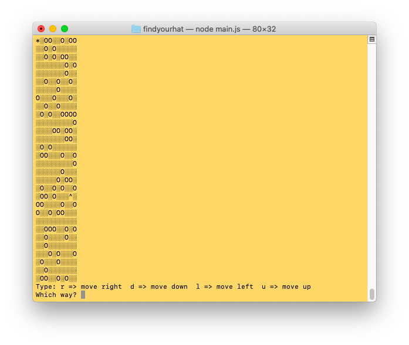

# Find Your Hat Game
    . A implementation of a maze game using java script running on Node environment.

## Description
    . The App introduces the user to three levels of the game.
    . Once user chooses between Tough, Medium or Easy. The game starts.
    . User is allowed to select r => move right  d => move down  l => move left  u => move up
    . Maze is represented by '░'
    . Hole is represented by 'O'
    . Hat is represented by '^'
    . User should reach the hat through the maze. if the user hit a hole the game is over.
    . Percentage of holes increases with selected of level. High being the maxiumum percentage of holes.

## Technology stack
    . JAVASCRIPT

## HOMEPAGE
